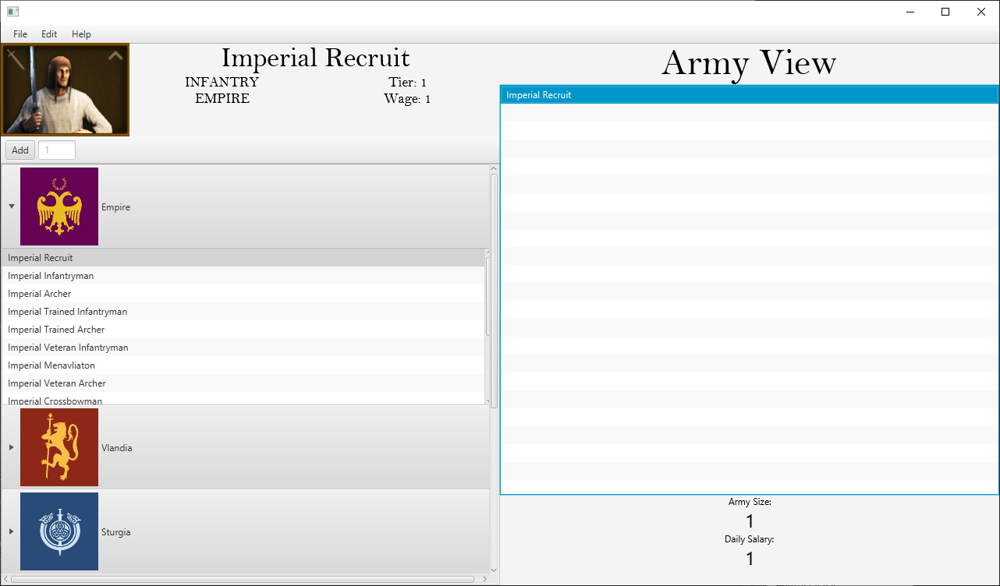

# Mount & Blade II: Bannerlord Calculator

## A battle simulator to help you manage your risk in Bannerlord

### At time of development(May 2020), I was using [this](https://www.reddit.com/r/mountandblade/comments/g3s7q9/what_you_should_know_about_auto_calc_kind_of_sad/) and other old materials as a reference. Given it's been many months since this project, the game which started out bare and in alpha stage is probably very different now. Though that means the project is now old and useless, it will remain on my GitHub to show prospective employers until I have real industry experience to show for

#### Object Oriented Programming Concepts Found in Project

- Classes
- Subclasses
- Abstract Classes
- Interfaces
- Collections
- Exception Handling
- Object Serialization
- Model-View-Controller(MVC) Architecture
- Polymorphism
- Inheritance
- Encapsulation
- Abstraction
- Etc
